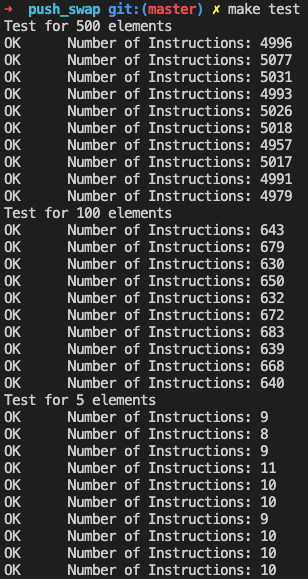
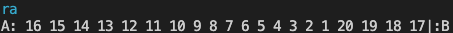
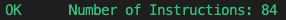
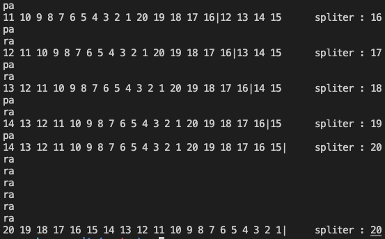

# Hello, welcome to my push_swap !
Grade: 125%  
For a list of 500: Average 5010 operations (5/5)  
For a list of 100: Average 660 operations (5/5)  

## Compilation


```
ARG=`ruby -e "puts (1..500).to_a.shuffle.join(' ')"`; ./push_swap $ARG | ./checker -n $ARG
```

## Flags implemented:
./checker -n $ARG : Display the number of operations  
./checker -c $ARG : Display with colors  
./checker -f $ARG : Display an animation of the two piles  
./push_swap -p $ARG : Display stages on the stack at some key stages

## Examples with flag:
```
ARG=`ruby -e "puts (1..20).to_a.shuffle.join(' ')"`; ./push_swap $ARG | ./checker -n -f -c $ARG
```




```
RG=`ruby -e "puts (1..20).to_a.shuffle.join(' ')"`; ./push_swap -p $ARG
```



## Good ideas I think I had:
- For the flag management, I stored the flag then dereferenced the pointer and called the flag management function again
- To store the list: I used one table of int who has the size of the list, and then when I pa or pb, I just have to move the separation between the two lists by one. Fast and easy for the compilation
